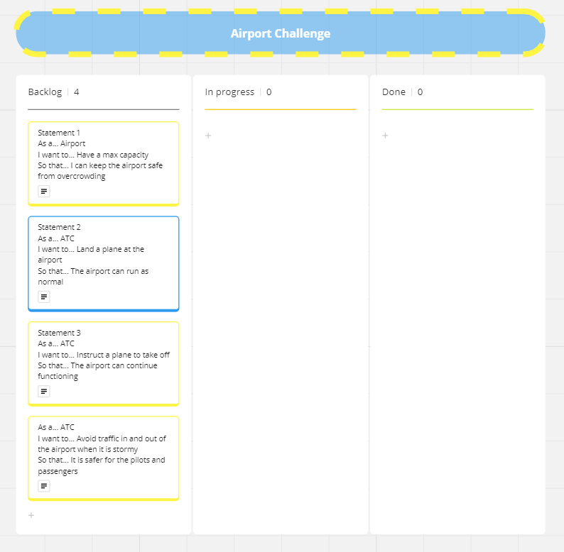

1.  Explain the benefits of the software to the client - why they need it and how it will help them. You should include:
    The problem that the software is solving
    The benefits that the software will bring to the client (Remember to include the "WHY" as well as the "WHAT")
    The risks associated with the software (Remember to include the "WHY" as well as the "WHAT")

This software is great; it combines a great user experience with complex technical challenges. This software will be able to understand and control the airport's plane capacity and allow ATC to land planes when there is space free, and take off planes that are already stationed at the airport. The software will even be able to understand detailed weather patterns and understand if the weather is too rough to fly in and out. This software will bridge the gap between technical knowledge and an easy to use system, this is so your ATC can make better decisions, faster. There is very little risk using this program due to the great control flow and input sanitization all heavily tested, however, due to the safety critical nature of the business, the software shouldn't be the only instrument used when landing and taking off planes.

2. From the requirements listed above, devise a set of user stories that describe the functionality that the client has requested.

