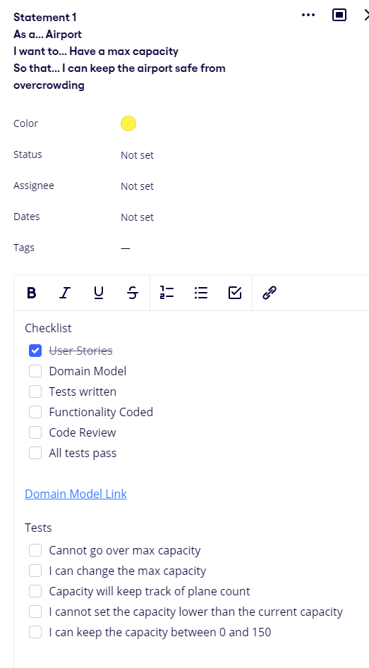
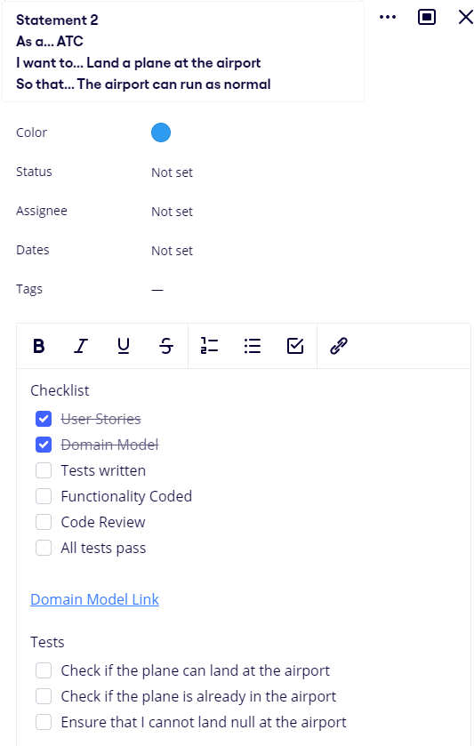
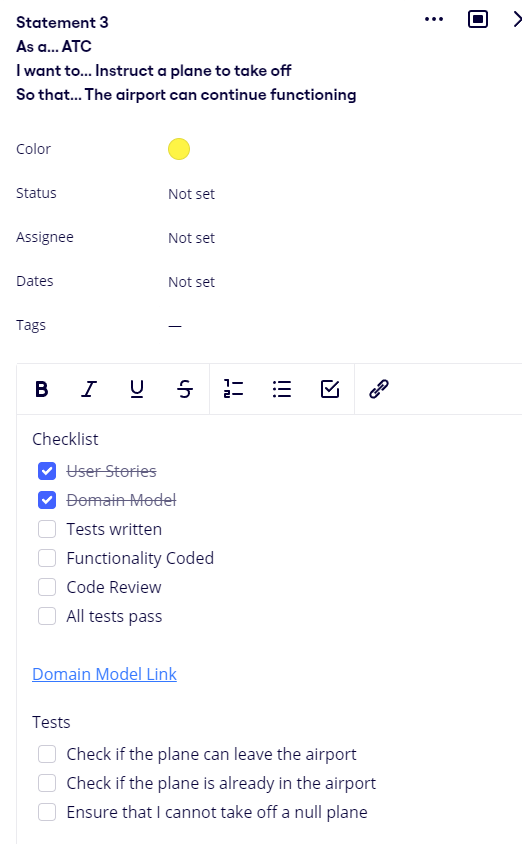
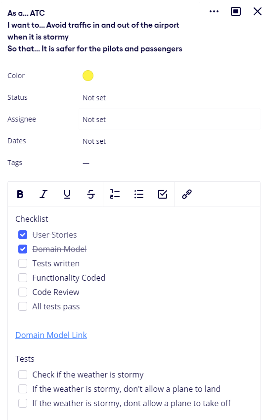
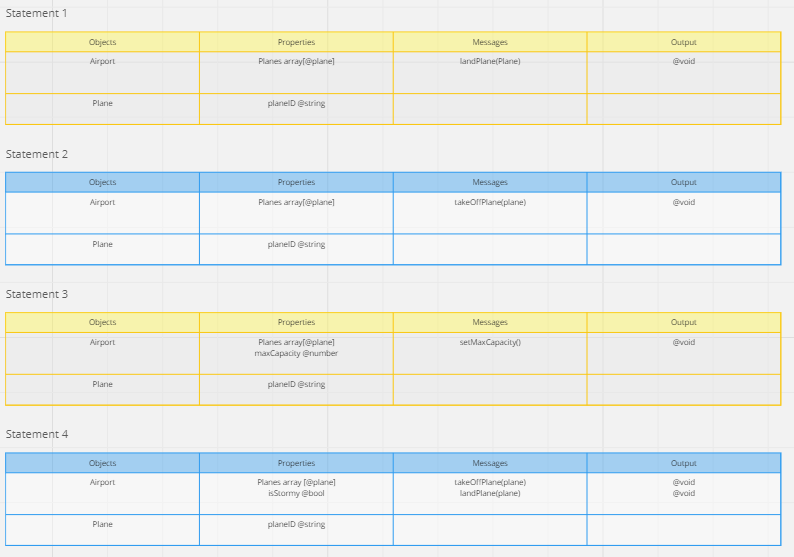

<h2> ** What is this software?? ** </h2>

This software is great; it combines a great user experience with complex technical challenges. This software will be able to understand the airport's ground space and airspace to optimally allow air traffic control to control their airport better than ever before. This software will bridge the gap between technical knowledge and an easy-to-use system, this is so your air traffic control can make better decisions, faster. There is very little risk in using this program due to the great control flow and input sanitization all heavily tested, however, due to the safety-critical nature of the business, the software shouldn't be the only instrument used by air traffic control when landing and taking off planes.

<h3> ** What problem is this software solving? ** </h3>

Air traffic control is an extremely high-stress career, helping guide millions of passengers safely in and out of the sky. With so much pressure on air traffic controllers, it is no wonder why so many people struggle to make a real career in the field. This software solves the problem of air traffic controllers having to make hard decisions by weighing up the information for them. Using this software is intuitive to use and uses facts to help air traffic controllers to choose when to land and take off planes. This is a significant safety increase to the current system which leaves a lot more in the hands of the controller and makes it hard to make correct decisions so frequently under so much pressure. 

<h3> ** The benefits that the software will bring to the client (Remember to include the "WHY" as well as the "WHAT") ** </h3>

Using intricate weather sensor technology patented by WeatherSensorsInc, this software can analyse the weather to see whether it is safe for a plane to take off or land at the airport. This safety measure is great for a safety-critical job like this. We use this sensor technology simply because it is the best in class, boasting record-breaking performance and is the exact thing you need in your air traffic control tower. We also have state-of-the-art control flow systems built into the software to ensure that even with mistaken inputs, the software can act appropriately and decipher if the input was correct or if the input was in error.

<h3> ** The risks associated with the software (Remember to include the "WHY" as well as the "WHAT") ** </h3>
 

2. From the requirements listed above, devise a set of user stories that describe the functionality that the client has requested.

3. From these user stories, create a domain model to describe how the objects will use messages to communicate with one another.

